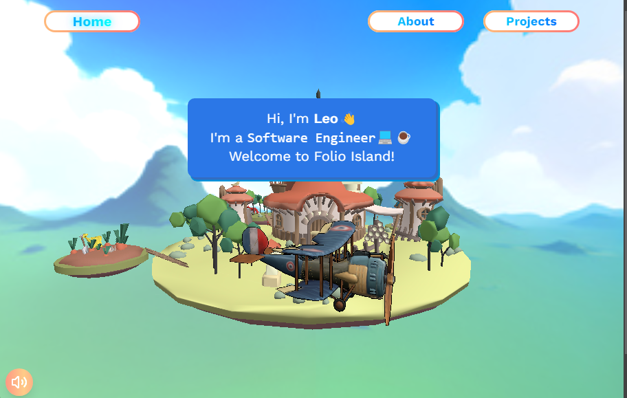
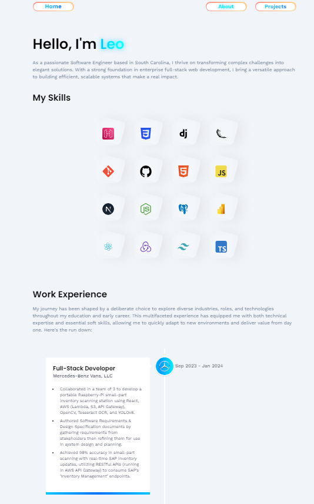
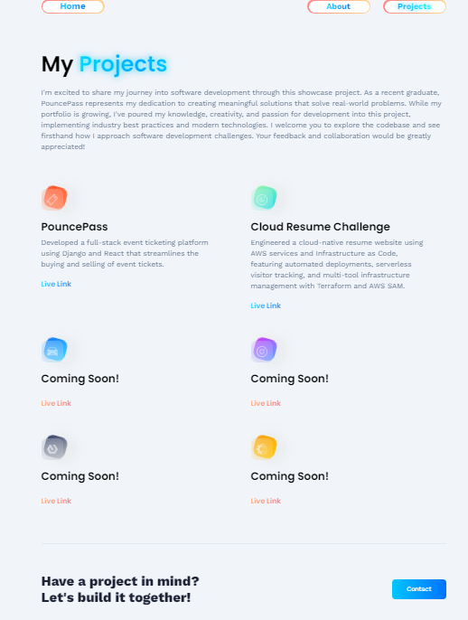
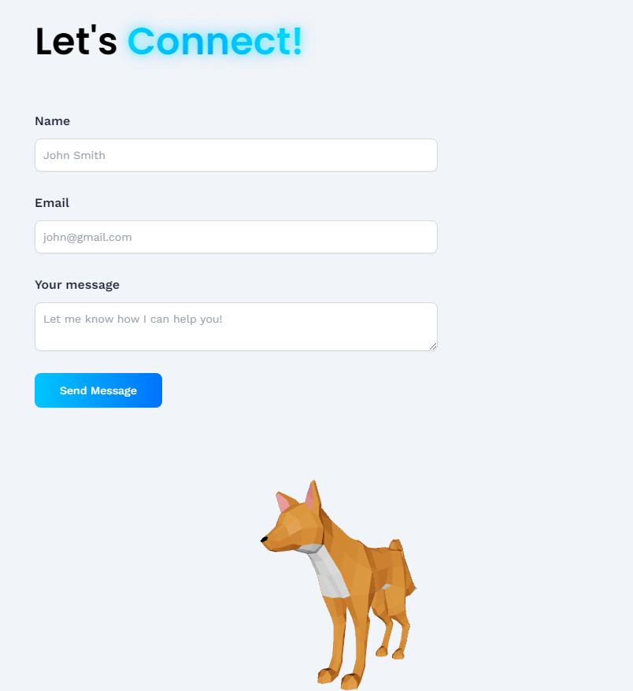

# **3D Portfolio Website**

A fully interactive 3D portfolio website built with **React**, **Three.js**, and **Vite**, showcasing projects, skills, and contact functionality. This project leverages modern web technologies, including **React Three Fiber**, **Tailwind CSS**, and **EmailJS**, to deliver an immersive user experience.

---

## 🚀 **Features**

- **Dynamic 3D Models:** Interactive 3D elements (e.g., plane, bird, island) rendered using Three.js and React Three Fiber.
- **Responsive Design:** Optimized for both desktop and mobile devices.
- **Project Showcase:** Display of projects with descriptions and live links.
- **Contact Form:** Integration with EmailJS to handle inquiries.
- **Performance Optimization:** FPS monitoring, dynamic quality scaling, and preloading of assets.
- **Smooth Animations:** Utilizes React Spring and Drei helpers for animations and transitions.

---

## 📂 **Project Structure**

The project follows a modular and organized structure:

```
3D_portfolio/
│
├── dist/                       # Distribution build files
├── node_modules/               # Project dependencies
├── public/                     # Static assets (favicon, static files)
│   └── vite.svg
├── src/                        # Source code
│   ├── assets/                 # 3D models, images, and icons
│   │   ├── 3d/                 # 3D models in GLB format
│   │   ├── icons/              # SVG and image icons
│   │   └── images/             # Static image assets
│   ├── components/             # Reusable UI components
│   ├── constants/              # Static project constants
│   ├── hooks/                  # Custom React hooks
│   ├── models/                 # 3D model components
│   ├── pages/                  # Main page components (Home, About, Projects, Contact)
│   ├── utils/                  # Utility functions (if any)
│   ├── App.jsx                 # Main application component
│   ├── index.css               # Global styles
│   ├── main.jsx                # Application entry point
│   └── vite.config.js          # Vite configuration
├── .env.local                  # Environment variables (for EmailJS)
├── package.json                # Project metadata and dependencies
└── README.md                   # Project documentation
```

---

## 🛠 **Technologies Used**

### **Frontend**
- **React** – Component-based UI framework.
- **Three.js** – 3D rendering and WebGL abstraction.
- **React Three Fiber** – React renderer for Three.js.
- **@react-three/drei** – Utility components for Three.js scenes.
- **@react-spring/three** – Animation library for Three.js.
- **React Router** – Client-side routing.
- **Tailwind CSS** – Utility-first CSS framework.

### **Tools & Libraries**
- **Vite** – Fast build tool for modern web projects.
- **EmailJS** – Email handling for contact form submissions.
- **Lucide React** – Icon set for React components.
- **Lodash** – Utility functions for JavaScript.

---

## 🔧 **Setup and Installation**

Follow these steps to set up the project locally:

1. **Clone the repository:**
   ```bash
   git clone <repository-url>
   cd 3D_portfolio
   ```

2. **Install dependencies:**
   ```bash
   npm install
   ```

3. **Set up environment variables:**
   - Create a `.env.local` file in the project root.
   - Add your EmailJS keys:
     ```env
     VITE_APP_EMAILJS_SERVICE_ID=your_service_id
     VITE_APP_EMAILJS_TEMPLATE_ID=your_template_id
     VITE_APP_EMAILJS_PUBLIC_KEY=your_public_key
     ```

4. **Start the development server:**
   ```bash
   npm run dev
   ```

5. **Open the project in your browser:**  
   Navigate to [http://localhost:5173](http://localhost:5173) to view the application.

---

## 📦 **Available Scripts**

Here are the scripts you can use to manage the project:

- **`npm run dev`** – Start the development server.
- **`npm run build`** – Build the project for production.
- **`npm run preview`** – Preview the production build.
- **`npm run lint`** – Run ESLint for code linting.

---

## 🖼 **Screenshots**

### **Home Page**


### **About Page**


### **Projects Page**


### **Contact Page**

---

## 🌐 **Pages and Components**

### **Pages**
| Page        | Description                                   |
|-------------|-----------------------------------------------|
| Home        | Main landing page with 3D models and animations. |
| About       | Introduction and professional background.     |
| Projects    | Portfolio showcasing projects and achievements. |
| Contact     | Contact form with 3D interaction and EmailJS integration. |

### **Components**
- **Navbar:** Responsive navigation menu with mobile and desktop views.
- **Footer:** Social media links and copyright information.
- **Loader:** Spinner animation for loading scenes.
- **ScrollToTop:** Scroll restoration on route change.
- **Alert:** Display alerts for form submission status.

---

## 🛡 **Performance Optimization**

- **Dynamic Quality Scaling:** The app dynamically adjusts rendering quality based on FPS.
- **Preloaded Assets:** All 3D models are preloaded to minimize runtime lag.
- **Efficient Animations:** Animations use lightweight libraries like React Spring.

---

## 📨 **Contact Form Configuration**

The contact form integrates with **EmailJS** for form submissions. Ensure that your EmailJS account is set up and `.env.local` contains the necessary service, template, and public keys.

---

## 🚨 **Known Issues**

- **Audio Playback Issues:** On some devices, autoplay might be restricted due to browser policies. Ensure user interaction (e.g., button click) before playing audio.

---

## 📝 **License**

This project is licensed under the **MIT License**. See the [LICENSE](LICENSE) file for details.

---

## 🙌 **Acknowledgments**

- 3D models and animations provided by Sketchfab and other open resources.
- Built with inspiration from modern interactive portfolios.

---

## 👨‍💻 **Author**

**Leonardo Georgeto**  
[Portfolio](https://leogeorgeto.com) | [LinkedIn](https://linkedin.com/in/georgetol) | [GitHub](https://github.com/LeoGeorgeto/Folio_Island)
